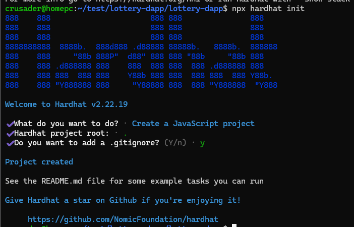

# 🎟️ Lottery DApp

This guide walks you through setting up and running the Lottery DApp on WSL2  
by **Dat Truong** and **Matteo Gristina**.

---

## ✅ Prerequisites (Host Machine)

Before cloning or running the project, ensure the following are installed on your system:

- **Node.js v22** installed via `nvm`
- **MetaMask** extension installed in your browser

### 🔧 Install Node.js via NVM (if not installed)

```bash
curl -o- https://raw.githubusercontent.com/nvm-sh/nvm/v0.40.2/install.sh | bash
\. "$HOME/.nvm/nvm.sh"
nvm install 22
nvm use 22
```

### 📦 Install Global Packages

```bash
npm install ethers vite
```

---

## 🚀 Setup Instructions (After Cloning)

### 1. Clone the Repository

```bash
git clone https://github.com/icrusader/lottery-dapp.git
cd lottery-dapp
```

---

### 2. Install Project Dependencies

```bash
npm install hardhat react-router-dom
```

---

### 3. Initialize Hardhat

```bash
npx hardhat init
```

When prompted, choose the options as shown below:



---

### 4. Replace Contract Code

Overwrite the contents of `contracts/Lock.sol` with:

```solidity
// SPDX-License-Identifier: MIT
pragma solidity ^0.8.18;

contract Lottery {
    address public manager;
    address[] public players;
    address public lastWinner;

    constructor() {
        manager = msg.sender;
    }

    function enter() public payable {
        require(msg.value >= 1 ether, "Minimum entry: 1 ETH");
        players.push(msg.sender);
    }

    function getPlayers() public view returns (address[] memory) {
        return players;
    }

    function getBalance() public view returns (uint256) {
        return address(this).balance;
    }

    function pickWinner() public restricted {
        require(players.length > 0, "No players to pick from.");
        uint index = uint(
            keccak256(
                abi.encodePacked(block.timestamp, block.prevrandao, players.length)
            )
        ) % players.length;

        address winner = players[index];
        payable(winner).transfer(address(this).balance);
        lastWinner = winner;
        delete players;
    }

    modifier restricted() {
        require(msg.sender == manager, "Only manager can call this");
        _;
    }
}
```

---

### 5. Run Local Blockchain

In a **separate terminal**:

```bash
npx hardhat node
```

---

### 6. Deploy the Smart Contract

In the **main terminal**:

```bash
npx hardhat run scripts/deploy.cjs --network localhost
```

Copy the deployed contract address if it differs from the one in the frontend  
(`src/utils/lottery.js`).

---

### 7. Start the Frontend App

```bash
npm run dev
```

---

## 💡 Notes

- Make sure MetaMask is connected to the Hardhat local network.
- Use one of the accounts provided by `npx hardhat node` for testing.

